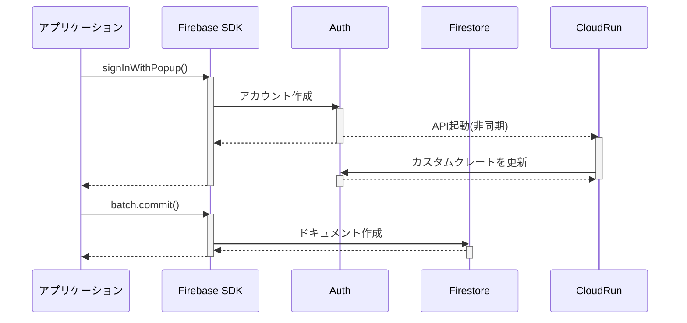

# firebase の使い方

## firebase authでユーザー管理

```mermaid
sequenceDiagram
    participant app as アプリケーション
    participant fs as Firebase SDK
    participant auth as Auth
    participant store as Firestore
    participant run as CloudRun

    app->>fs: signInWithPopup()
    activate fs

    fs->>auth: アカウント作成
    activate auth
    auth-->>run: API起動(非同期)
    activate run
    auth-->>fs: 
    deactivate auth
    run->>auth: カスタムクレートを更新
    activate auth
    auth-->>run: 
    deactivate auth
    deactivate run

    fs-->>app: 
    deactivate fs

    app->>fs: batch.commit()
    activate fs

    fs->>store: ドキュメント作成
    activate store
    store-->>fs: 
    deactivate store

    fs-->>app: 
    deactivate fs

```
